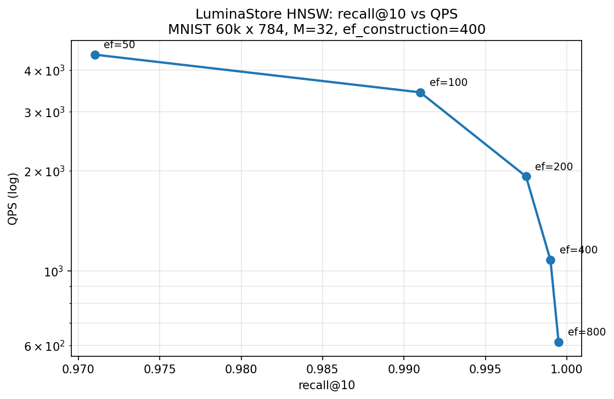
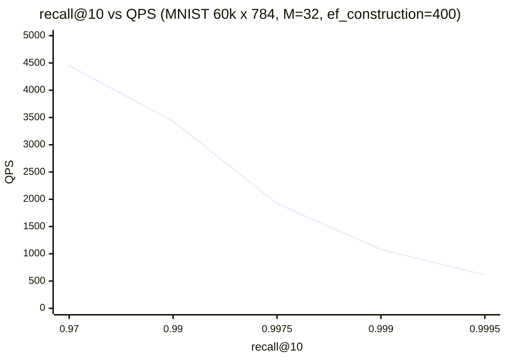

# LuminaStore

LuminaStore is a high-performance **embedded vector database** for real-time
retrieval scenarios (local / edge / desktop / single-machine apps): an HNSW
approximate nearest neighbour index fused with a WAL-backed storage layer
(payload + scalar filter fields persist across restarts).

- **Embedded-first**: zero-deploy, in-process, microsecond-latency (vs
  server-side engines that pay network + process overhead)
- **Storage**: append-only WAL (CRC32, big-endian, tail repair), snapshot +
  manifest incremental recovery
- **Index**: HNSW with heuristic neighbour selection, tombstone delete/update,
  injectable metrics (L2 / IP / Cosine)
- **Quantization**: SQ8 / Binary / PQ with SIMD kernels (4x–32x memory cuts,
  code-to-code distance 2-4x faster than full-precision L2)
- **Filtering**: bitmap filter index, in-filter / post-filter search modes
- **API**: handle-based C API, Python (ctypes + numpy) bindings, plus gtest /
  google-benchmark suites

Embedded-scenario comparison vs Chroma / usearch / Qdrant:
see [docs/embedded_benchmarks.md](docs/embedded_benchmarks.md).

## Build

```bash
cmake -S . -B build -DCMAKE_BUILD_TYPE=Release
cmake --build build -j
ctest --test-dir build            # all unit tests
```

ASAN build:

```bash
cmake -S . -B build-asan -DCMAKE_BUILD_TYPE=Debug -DLUMINA_ENABLE_ASAN=ON
cmake --build build-asan -j
```

## Quick start (C API)

```c
void* h = lumina_open("/tmp/db", /*dim=*/128, /*metric=*/0);   // 0=L2, 1=IP, 2=Cosine
lumina_add(h, 1, vec, 128, "payload-text");
lumina_add_batch(h, ids, vectors_flat, n, 128, payloads);
char* json = lumina_search(h, query, 128, /*top_k=*/10);       // {"results":[...]}
lumina_snapshot(h);               // durable snapshot + WAL watermark
lumina_close(h);
```

## Quick start (Python)

```python
import lumina, numpy as np

with lumina.open_collection("/tmp/db", dim=128, metric=0) as col:
    col.add(ids=np.arange(1000), vectors=vecs, payloads=["..."] * 1000)
    hits = col.search(queries, top_k=10)      # list of {id, distance, payload}
    col.snapshot()
```

## Benchmarks

See [docs/benchmarks.md](docs/benchmarks.md) for recall-QPS curves,
quantization and filtering numbers, and reproduction commands.





## On-disk formats

- WAL: 8-byte file header `[LMST][version][reserved]` then frames
  `[OpType][CRC32][len][payload]`; ops `Put/Delete/VectorPut/VectorPutV2`.
  Tail corruption is truncated on open, middle corruption is reported.
- Snapshot (`snap-<seq>.snap`): magic `LMSN` + index table + WAL watermark;
  manifest (`MANIFEST`) records the latest snapshots; recovery loads the
  snapshot then replays the WAL tail.
- HNSW file: magic `LMHN` + graph (nodes, layers, neighbour lists, tombstones).

## Project layout

```
include/lumina/
  common/     Status, Slice, Options, CRC32, SIMD dispatch
  storage/    StorageEngine, LogManager (WAL), IndexManager, snapshot, manifest
  index/      HNSW, quantizers (SQ8/Binary/PQ), FilterIndex
  engine/     Collection (top-level), search pipeline, filter expressions
  vector/     SIMD distance kernels, aligned allocator
src/          matching implementation directories
cpp_engine/   C API shared library (luminastore_shared)
python/       ctypes + numpy bindings
bench/        storage / vector / quant / filter benchmarks
tools/        ann_bench (recall-QPS evaluator)
tests/        gtest suites
```

Design and research notes: [V2_DESIGN.md](V2_DESIGN.md) and [RESEARCH.md](RESEARCH.md).
